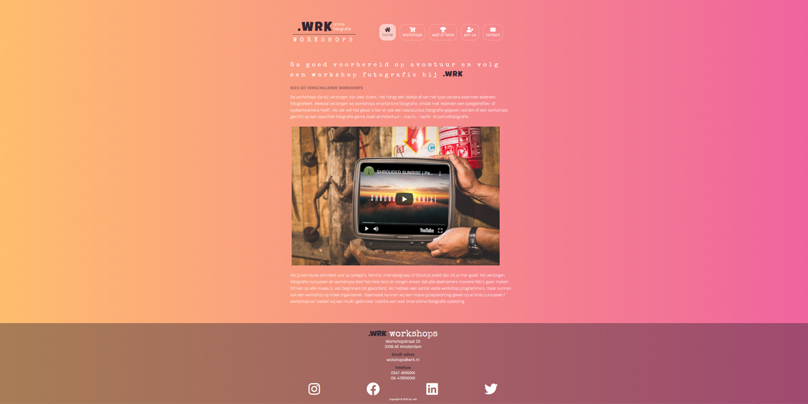

<<<<<<< HEAD
<h1># .WRK-Photograph-Workshops-HTML-CSS</h1>

<h3>https://wrk-workshops-3ff708.netlify.app/</h3>

<h3>Opdracht : Hackathon: maak eigen website met HTML/CSS </h3>
</img>

<h4>Minimum vereisten: </h4>

- Zorg dat jouw website de volgende eigenschappen heeft, meer mag natuurlijk altijd!
- Gebruik een duidelijk onderwerp voor jouw website: "mijn website gaat over... "
- Gebruik meerdere pagina's in jouw website.
- Gebruik minsten 5 verschillende HTML elementen.
- Gebruik semantische HTML elementen op de juiste plaatsen met de juiste betekenis.
- Gebruik CSS in een losse stylesheet (gebruik geen inline CSS = CSS in de HTML & gebruik geen CSS frameworks).
- Gebruik minstens op 2 plekken, padding margin of borders op jouw website. Met andere woorden: laat aan ons zien dat jij het box-model onder de knie hebt.
- Gebruik minstens 1 plaatje.
- Gebruik minsten 2 links.
- Gebruik MediaQueries, zodat je website er anders uit ziet op mobiel en op desktop.
- Gebruik CSS-grid om een layout te maken en al je elementen op de pagina te positioneren
- Gebruik CSS-grid om een layout te maken en al je elementen op de pagina te positioneren
- Gebruik flex-box om elementen te positioneren.
- Gebruik minstens 1 formulier op jouw website.
- Jouw website is mobile-first. De basis CSS is voor een mobiele telefoon, de extra CSS voor op desktop staat in een media-query.

- We kijken ook naar de netheid: zorg dus dat alle "spelfoutjes" uit je code zijn (gebruik een linter).
     - Zorg daarnaast dat je code juiste geformatteerd is. Gebruik spaties en enters op de juiste manier .
=======
## .WRK - Photography Workshops

  #### **Assignment: Hackathon make your own website with HTML / CSS**
  #### **Take a look at this project : https://wrk-workshops-3ff708.netlify.app/**
 

## Minimum requirements:

  - Make sure your website has the following features, more is always allowed!
  - Use a clear topic for your website: "my website is about ..."
  - Use multiple pages in your website.
  - Use at least 5 different HTML elements.
  - Use semantic HTML elements in the right places with the right meaning.
  - Use CSS in a separate style sheet (don't use inline CSS = CSS in the HTML & don't use CSS frameworks).
  - Use at least 2 places, padding margin or borders on your website. In other words: show us that you have mastered the box model.
  - Use at least 1 picture.
  - Use at least 2 links.
  - Use MediaQueries to make your website look different on mobile and desktop.
  - Use CSS grid to create a layout and position all your elements on the page
 - Use flex-box to position elements.
  - Use at least 1 form on your website.
 - Your website is mobile-first. The basic CSS is for a mobile phone, the extra CSS for the desktop is in a media query.
  
>>>>>>> 880f8952df1f30bb89dd24f4a58e6c303d2ac737

## Bonus for extra points:

<<<<<<< HEAD
- Gebruik een embedded YouTube video.
- Gebruik veel mooie afbeeldingen, bijvoorbeeld van stockfoto websites.
- Gebruik ook een design en gebruik media-queries voor andere screen-sizes, denk aan: tablet.
- Gebruik mooie op elkaar afgestemde kleuren.
- Gebruik externe libraries zoals Google Fonts, om extra CSS aan je website toe te voegen.
- Gebruik een uitgebreid formulier met veel verschillende soorten inputvelden.
=======
  - Use an embedded YouTube video.
  - Gebruik veel mooie afbeeldingen, bijvoorbeeld van stockfoto websites.
  - Use lots of beautiful images, for example from stock photo websites.
  - Use beautifully coordinated colors.
 - Use external libraries such as Google Fonts to add extra CSS to your website.
- Use an extensive form with many different types of input fields.

>>>>>>> 880f8952df1f30bb89dd24f4a58e6c303d2ac737
